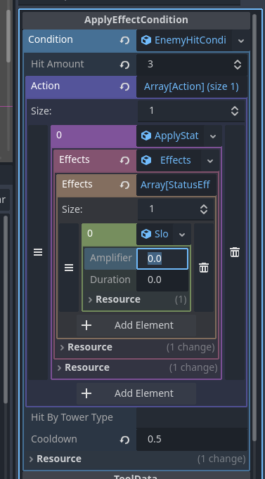
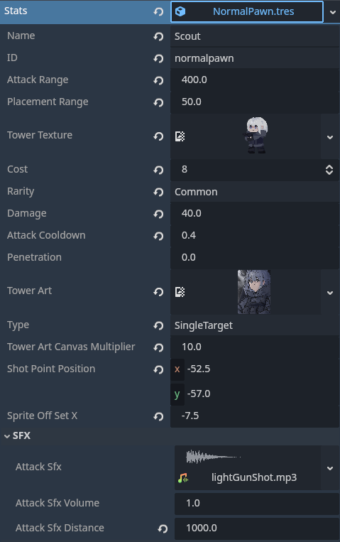
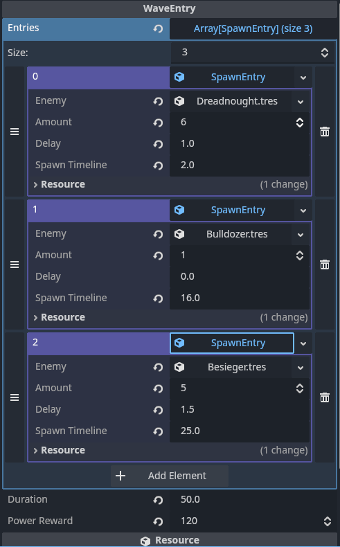

# Salt and Steel

## Table of Contents

* [About](#about)
* [Gameplay](#gameplay)
* [Development](#development)
* [License](#license)
* [Credits](#credits)

## About

**Salt and Steel** is a personal video game project developed over approximately **4 months**, starting when I was 16 years old. It is a hybrid of **tower defense and deckbuilding**, where each tower is represented by a card. The project features an anime-inspired, painterly art style and was originally planned as a one-month chess-based tower defense prototype before expanding into a much larger project.

**All illustrations and artwork were created by me. No AI-generated assets were used.** AI was only used as a programming learning aid, mainly for understanding APIs and writing repetitive logic.

### [**Demo video of the game if you are interested**](https://www.youtube.com/watch?v=Rblf9fGSIx8)

## Gameplay

<i>Gameplay demonstration</i>

The player builds a deck of tower cards and draws a hand of cards during each run. Playing a card places its corresponding tower on the map, with different towers having different attack ranges, damage, attack speeds, targeting behaviors, and attack types. Enemies follow preset paths toward the Base, rewarding **Power** when defeated. Power is the game's only currency and is used to place towers, reshuffle the deck, and purchase **Tools**, which provide upgrades and additional effects. Between waves, the player can modify their deck, purchase Tools, and prepare their defense. The player wins by clearing all waves and loses when the Base's HP reaches zero.

**For more details please read the [Gameplay Documentation](docs/GameplayDocumentation.md)**

## Development

*Salt and Steel was one of my first larger projects in game development and software engineering. Some early design decisions are questionable in hindsight, but keeping them allowed me to see how my approach to development evolved throughout the project.*

The game was developed using **Godot 4.x**, **GDScript**, and **GDShader**, with a strong focus on **data-driven architecture** using custom Godot `Resource`s. Waves, towers, and other gameplay data are separated from the systems that process them, allowing new content to be added with minimal changes to the underlying code. One of the systems I'm most proud of is the **Condition & Action system**, which allows gameplay effects to be composed from reusable conditions, actions, and effects instead of hard-coding the behavior of individual Tools. More detailed technical documentation will be provided separately.

**For more details please read [Development Documentation](docs/DevelopmentDocumentation.md)**

*some example of the ~~peak~~ data-driven architecture*
<table>
  <tr>
    <td>
      
      
<i>The condition system. The best architecture I made in S&S imo</i>

    </td>
    <td>
      
      
<i>The Tower Data system</i>

    </td>
    <td>
      
      
<i>The Wave Data system</i>

    </td>
  </tr>
</table>

## License

The source code of Salt and Steel is licensed under the **MIT License**.

Original artwork, characters, game assets, and other creative content
are **not** covered by the **MIT License** and **remain All Rights Reserved**,
unless otherwise stated.

Third-party assets remain under their respective licenses.

## Credits

* [Main Menu Music](Asset/Musics/25.%20The%20Step%20Below%20Hell.mp3) - [**A Step Below Hell By DM Dokuro**](https://www.youtube.com/watch?v=1AjS81A8XtA)
* [In-game Music](Assets/Musics/Killers) - [**Killers By Kevin Macleod**](https://www.youtube.com/watch?v=UhrAb_qON94)

