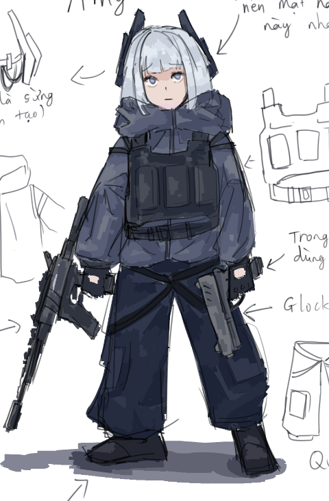
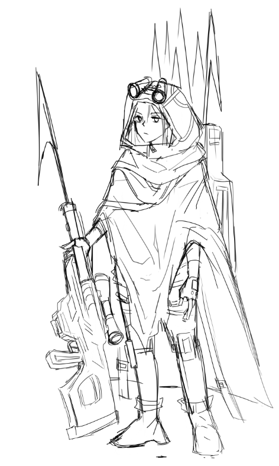
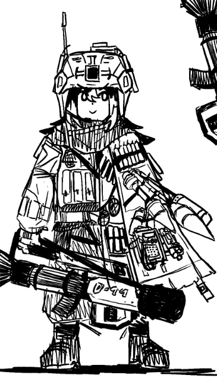

# Creative And Future Direction

## Core Design Philosophy

Salt and Steel creative designs revolved around tactical/military-feeling, and sea-theme. 

## Game Design

The **demo** is very simple, all of the mechanics are explained in the [**gameplay documentation**](docs/GameplayDocumentation.md). 
So in this section, I won't just talk about the game design philosophy about this current demo, but for future updates and my ambition. 

At the core, I want **Salt and Steel** to lean more toward deckbuilding, which is what the current demo is not doing really well at. The core gameplay loop should be adapting to your current deck and preparing for the next waves. Resource management also plays a huge role here as the gameplay depends entirely on **one** currency, which is **Power**. Player should make decisions to whether use Power to place their cards, reshuffle their hand, buy new items and other tactical decisions future updates. 

**RNG-control** should plays a big role in the game, as of current, the hand (and deck) is an example for this, as the player can control which card will likely appear the most in their hand after building their deck. However, RNG-control must also appear in how the player obtain their deck/items. Players should be able to build their setup without relying too much on randomness.

## Art Style

The game features heavy tactical/military aesthetic. I will talk about some of the character design in this section.

### Amy (Scout)

Amy is my most favourite character so far. Her design is simple, a small girl wearing thick jacket with a tactical/bulletproof vet. Her timid expression and personality really make Amy suiting for the "most" basic, early-game tower. The white hair and blue eyes also play a role in making her more memorable and iconic.
(Ignore the horn for now, It's here because of **lore**)

### Sniper

The Sniper is designed to give off that "camouflage" feeling, the green tone was here to represents the color of plants and jungles. Her cloak is actually inspired by Death's cloak in **Puss in Boots 2** *(aka a black poncho)* to sell that ragged/vetera vibe. Since the game takes place in the ocean, I made her sniper rifle into a more... advanced harpoon launcher instead.

### Cannon

Cannon is also one of my best design. I made her personality more active, explosive, a tiny gremline basically, as Cannon is a splash/AOE tower. Her characteristics need to match her role.

Overall, this is by far the most notable character designs I made in this project.

## Lore

In the game, you are the **commander** of a mercenary group that contracted with a government to help them with certain crisis related to sea monsters. The plot is relatively simple and easy to understand.
However, **Salt and Steel** is set in the universe of **Project Cicada**, a much larger science-fantasy that I've been working on for around a year since the demo released. The game acts as a small part of this setting rather than explaining its entire history. For personal reason, I will not spoil and reveal too much things about the lore to preserve the ongoing development of **Project Cicada**. 

## Future Directions

### Game Design
#### Problems
The main problem about the current demo is that it is leaning too much into **Tower Defense**, making the deckbuilding mechanics much less significant as the towers don't disappear after each wave, so the cards you play before are still effective even after that wave end. You can just luckily get an OP tower early on and that tower will stay here for the entire game to carry you. That really reduce the depth of the game and just make it "watch towers shoot enemies" after you managed to placed an OP team. The game is also very knowledge-based, since you can't place towers during a wave, you can't react to things that you didn't know before (such as a high speed enemy) until the wave ends. 
#### Solutions
I've been thinking about making every single tower on the map retreats when a wave end, so that the player won't just depend on one setup for the entire game. We also need more RNG-control, such as this concept I've think about called **"Communicator"** where you can paid power to increase the chance of getting certain types of tower/item of your choice. Mechanics that increase depths such as upgrades might also get added in the future.

### UI Design
The current UI looks very rough, with many being literal placeholders since the beginning of the project. I will definitely try to improve it to match the military aesthetic of the game, and increasing the readability overall.

